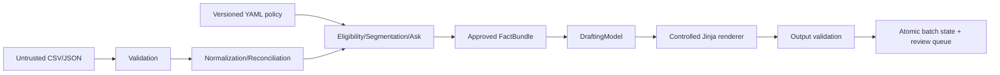
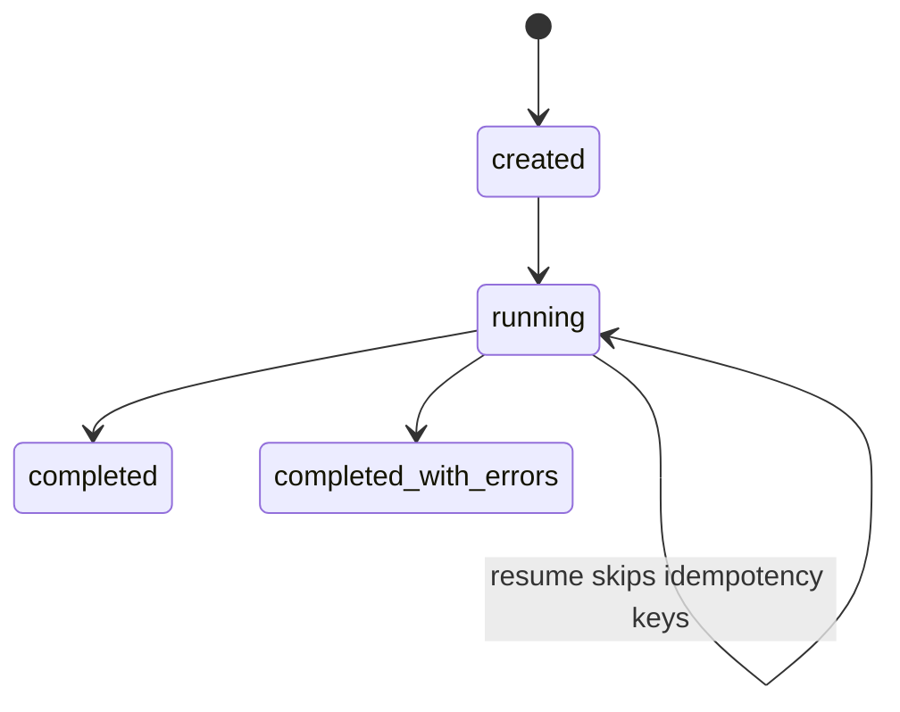
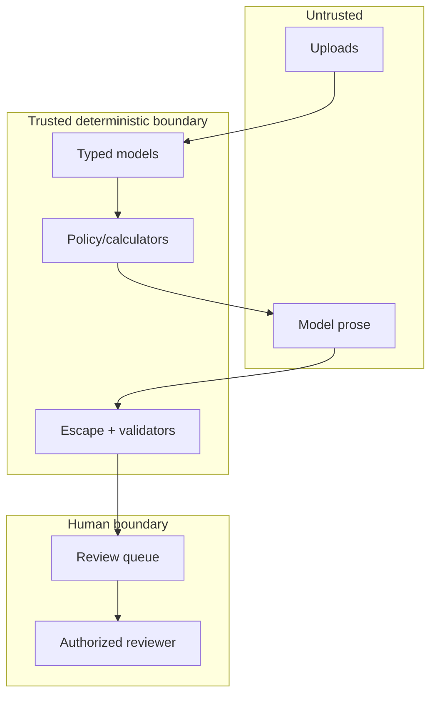

# Architecture



```mermaid
sequenceDiagram
  participant B as Batch
  participant P as Policy engine
  participant L as LLM adapter
  participant V as Validator
  B->>P: typed normalized donor
  P-->>B: eligibility, segment, exact ask, claims
  alt suppressed
    B-->>B: persist reason; never call LLM
  else eligible
    B->>L: bounded FactBundle
    L-->>B: NarrativeDraft only
    B->>V: escaped templates + exact ask/claims
    V-->>B: review-required result
  end
```





Modules own one concern; templates contain no policy logic, prompts contain no arithmetic, and no global mutable business state exists. The provider boundary is replaceable and production behavior does not depend on the fake.

